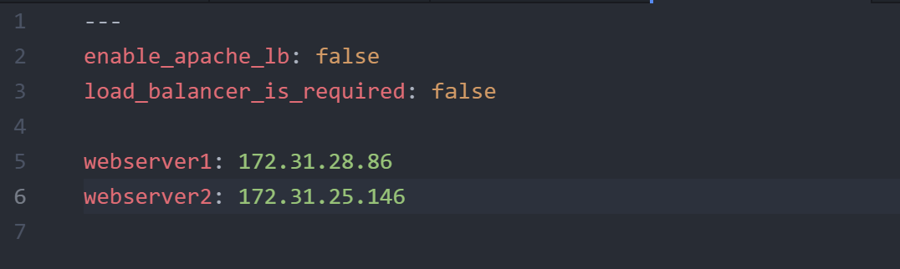

# Introducing Dynamic Assignment Into Our structure
This is a continuation project from ansible refactoring, static assignment and roles project. [See here](https://github.com/oayanda/ANSIBLE-REFACTORING-AND-STATIC-ASSIGNMENTS-IMPORTS-AND-ROLES-)

Start a `new branch` in the `https://github.com/oayanda/ansible-config-mgt` GitHub repository  and call it `dynamic-assignments`.


Create a new folder under the main directory `ansible-config-mgt`, name it `dynamic-assignments`. Then inside this folder, create a new file and name it `env-vars.yml`.


Create a folder to keep each environment’s variables file. Let's called it `env-vars`, then create yaml files for each environment.


Now paste the instruction below into the `env-vars.yml` file.

```bash
---
- name: collate variables from env specific file, if it exists
  hosts: all
  tasks:
    - name: looping through list of available files
      include_vars: "{{ item }}"
      with_first_found:
        - files:
            - dev.yml
            - stage.yml
            - prod.yml
            - uat.yml
          paths:
            - "{{ playbook_dir }}/../env-vars"
      tags:
        - always

```


## Update site.yml with dynamic assignments

Update `site.yml` file to make use of the dynamic assignment with the code snippet below

```bash
---
- hosts: all
- name: Include dynamic variables 
  tasks:
  import_playbook: ../static-assignments/common.yml 
  include: ../dynamic-assignments/env-vars.yml
  tags:
    - always

-  hosts: webservers
- name: Webserver assignment
  import_playbook: ../static-assignments/webservers.yml

```


## Community Roles

Create a role for MySQL database – it should install the MySQL package, create a database and configure users.
However, we can simplily do by using pre-develop, production ready ansible roles from   [Ansible galaxy](https://galaxy.ansible.com/home).

We will use a  [MySQL role developed by geerlingguy](https://galaxy.ansible.com/geerlingguy/mysql).

On Jenkins-Ansible server make sure that git is installed with git --version, then go to ‘`ansible-config-mgt`’ directory and run.

> Disable Your Github webhook - it is not needed to complete and also to maintain the code.

```bash
# To verify Git is installed
git --version
```


In the ansible-config-mgt directory run the code in the snippet below.

```bash
git init
git pull https://github.com/<your-name>/ansible-config-mgt.git
git remote add origin https://github.com/<your-name>/ansible-config-mgt.git
git branch roles-feature
git switch roles-feature
```


## Community roles using ansible galaxy

Inside `roles` directory create your new MySQL role with `ansible-galaxy install geerlingguy.mysql` and rename the folder to `mysql`

```bash
cd ansible-config-mgt
mkdir roles
cd roles

# Mysql role creation from Anible Galaxy
ansible-galaxy install geerlingguy.mysql

mv geerlingguy.mysql/ mysql
```


Read `README.md` file, and edit roles configuration to use correct credentials for MySQL required for the `tooling` website.

In the `default` folder of the MySql parent directory, edit the main.yml file.


Uncomment and update authentication details in the file. Save abnd exit.


Upload the changes into your GitHub

```bash
git add .
git commit -m "Commit new role files into GitHub"
git push --set-upstream origin roles-feature
```

## Load Balancer roles

We are have used Nginx and Apache application Load balancers manually in the previous project but now we are going to implement same with ansible roles. However, we can run both at the same time because both perform similar job as a application load balancer but we can configure them in such a way that we can choose which one to use.

In other to choose which Load Balancer to use, Nginx or Apache, we need to have two roles respectively - Nginx and Apache.

> To better understand the roles and it's components - I have decided to create the roles for the Load balancers(Nginx and Apache ) manually.

Create Both Nginx and Apache roles to contain this subfolders `defaults, tasks, handlers and templates`. Create a `main.yml` file in each `default, tasks and handlers`.

For both Nginx's and Apache's `defaults/main.yml` files, add a control variable as well as the webserver ip's `enable_apache_lb: false`
and `load_balancer_is_required: false`

For Apache role in defaults/main.yml

For Nginx role in defaults/main.yml


For Apache handlers/main.yml, it holds a play to be trigger a `notify` keyword in tasks/main.yml. This is used because of the change in the configuration file which requires the apache service to be restarted to effect the change.

For Apache role in handlers/main.yml


The tasks/main.yml file holds the main tasks for both roles (Nginx and Apache). This includes install, editing the configuration file as well enable some services.

For Apache role in tasks/main.yml


For Nginx role in tasks/main.yml


`templates/` holds the required file in the tasks/main.yml play.

For Apache role in templates/vhosts.conf.j2


For Nginx role in templates/nginx.conf


Create `loadbalancer.yml` in the static-assignment folder to control the LB roles and iniate the LB roles like this below.


Let's update the main `playbooks/site.yml` file


Finally for this concurrent setup, let's add the control logic in `dev.yml` since `with_first_found ` from the `dynamic-assignment/env-vars.yml` file we included above will process the first file found. This means, it will find dev.yml first.


In `env-vars/dev.yml`


>With `enable_apache_lb` and `load_balancer_is_required` set to `true` - This means apache load balancer would be configured and if nginx is true, nginx would be configured.

> Make sure to open required ports - 80 and 3306

Run Playbook

View in the browser
